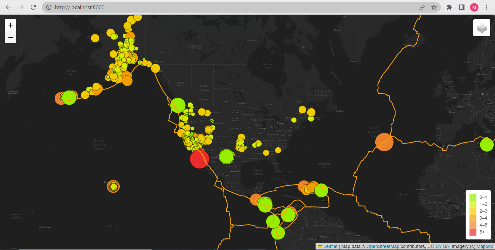

# Mapping_Earthquakes

## Project Overview

In this project, I develp an interactive map through visualization of GeoJSON data related to earthquake occurences around the world. The earthquakes data is shown on the world map by adding different layers to the map such as tectonic plates lines, earthquake locations and magnitude. The map also is empowered by displaying the earthquake data in three different views (i.e., street, satellite, and dark).

## Resources
**Data Sources:** [Earthquakes GeoJSON](https://earthquake.usgs.gov/earthquakes/feed/v1.0/summary/all_week.geojson), [Tectonic Plate GeoJSON](https://raw.githubusercontent.com/fraxen/tectonicplates/master/GeoJSON/PB2002_boundaries.json), and [Earthquakes above 4.5mag GeoJSON](https://earthquake.usgs.gov/earthquakes/feed/v1.0/summary/4.5_week.geojson).

**Software:** JavaScript, HTML/CSS, Visual Studio Code 1.73.1, Leaflet 1.9.3 D3.js 7.6.1

## Results

**Link to the interactive map:** 

Below are screenshots of the map in Streets, Satellite, and Dark views, including earthquake data within different layers of magnitute.

